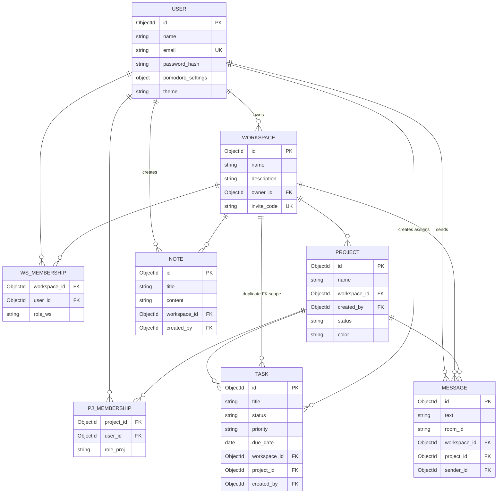
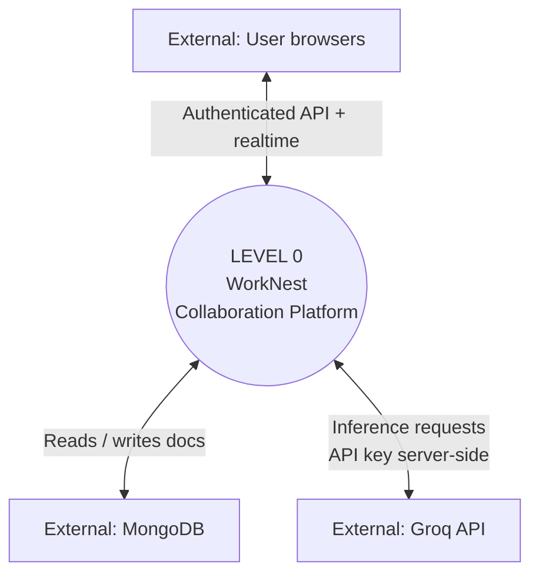
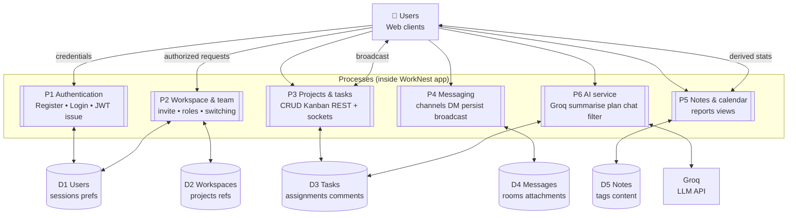
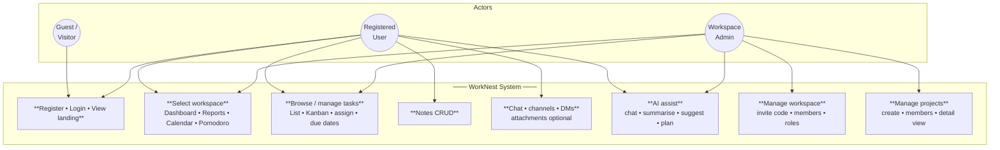
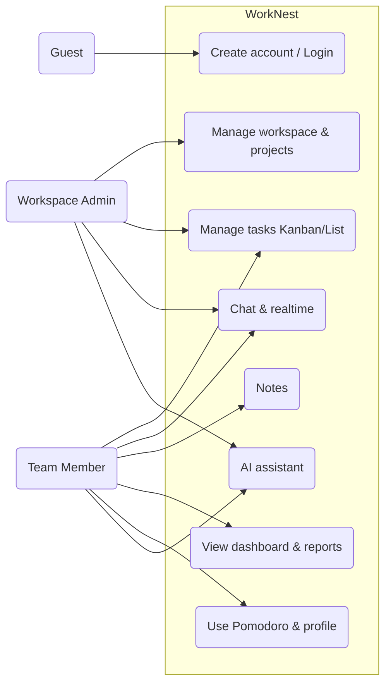

# WorkNest — Diagrams for Presentation & Viva

Copy each Mermaid block into [Mermaid Live Editor](https://mermaid.live) or VS Code preview / Google Slides Mermaid addon to export as PNG/SVG for PPT.

---

## 1. ER Diagram



**Viva explanation (ER):** This diagram maps MongoDB **documents to ER entities**—**WS_MEMBERSHIP** and **PJ_MEMBERSHIP** stand for embedded member arrays linking users to workspaces and projects with **roles**. **TASK** hangs off both **workspace and project**, matching the schema requirement for every task to sit under a project in a workspace. **MESSAGE** optionally adds **project** or **room** scoping so channel chat is separate from board data.

---

## 2. Data Flow Diagram — Level 0 (Context)

*Level 0 shows the system as one process and flows from external entities.*

```mermaid
flowchart LR
    subgraph Entities["External entities"]
        A[("👤 Users\n(Browsers)")]
        E[("🤖 Groq AI\n(Cloud LLM API)")]
    end

    S[[("⚙️ WorkNest\nSystem\n( SPA + REST + WebSockets )\n─────────────────\nNode · Express · Socket.IO\nMongoDB")]]

    subgraph Storage["Persisted store"]
        D[("📦 MongoDB\nDatabase")]
    end

    A <-->|HTTP/HTTPS\nJSON + JWT| S
    A <-->|Socket.IO\nreal-time events| S
    S <-->|Mongoose\nqueries writes| D
    S <-->|HTTPS\nGroq SDK| E
```

**Simpler PPT variant (minimal — text boxes over diagram):**



**Viva explanation (DFD‑0):** **Level 0** is the **system context**: users interact only with WorkNest via **REST + JWT** and **Socket.IO**; the application reads/writes **MongoDB**, and optionally calls **Groq** from the server. No internal breakdown—good for answering “who talks to whom.”

---

## 3. Data Flow Diagram — Level 1

*Processes represent major subsystems; data stores labelled D numbered for DB areas.*



**Viva explanation (DFD‑1):** **Level 1** splits WorkNest into **logical subprocesses**: identity, teamwork, tasks (with realtime), chat storage, secondary views (notes/reports/dashboard data), and **AI**. Data stores map to Mongo **collections logically**—tasks feed both UI and filtered AI prompts; chat is isolated from Kanban mutations.

---

## 4. Use Case Diagram

*Generalized actors and system boundary (suitable for PPT).*  



**Alternative — classic use-case style labels only (even cleaner for slides):**



**Viva explanation (Use Case):** **Actors** are **Guests** (minimal), **Members** doing daily task/chat/note/report work, and **Admins** handling **invite and membership**. Use cases bundle **frequency** workflows (Kanban vs AI) so examiners see **role separation** without listing every API route.

---

## Quick PPT tips

| Diagram | Tip |
|--------|-----|
| ER | Export wide layout; keep only one relationship line per pair on slide if crowded. |
| DFD‑0 | One slide; emphasise “browser → app → DB + AI”. |
| DFD‑1 | Optional second slide; number P1–P6 to match your oral script. |
| Use case | Use the second (graph LR) variant if space is tight. |

---

*Generated for WorkNest repository — align names with your final report if you rename modules.*
